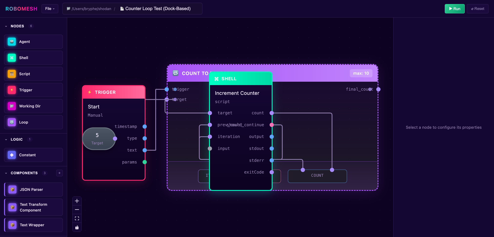

# Robomesh

[](https://github.com/tommy-xr/robomesh-ai/actions/workflows/ci.yml)

AI Agentic Orchestration Tool - easily define, visualize, and debug workflows spanning multiple coding agents



## Developer Setup

### Prerequisites
- Node.js 20+
- pnpm (enable via `corepack enable pnpm`)

### Installation
```bash
pnpm install
```

### Development
```bash
# Run both server and designer in dev mode
pnpm run dev

# Or run individually
pnpm run -F server dev
pnpm run -F designer dev
```

### Build
```bash
pnpm run build
```

### CLI
```bash
# Validate workflows
pnpm run robomesh -- validate workflows/*.yaml

# Run workflow tests
pnpm run test:workflows
```

### Global CLI (for development)
```bash
# Link the CLI globally to use 'robomesh' command from anywhere
pnpm run build
cd packages/cli && pnpm link --global

# Now use from any directory
robomesh run /path/to/workflow.yaml
robomesh validate /path/to/workflow.yaml

# After code changes, just rebuild
pnpm run build

# To unlink
cd packages/cli && pnpm unlink --global
```
